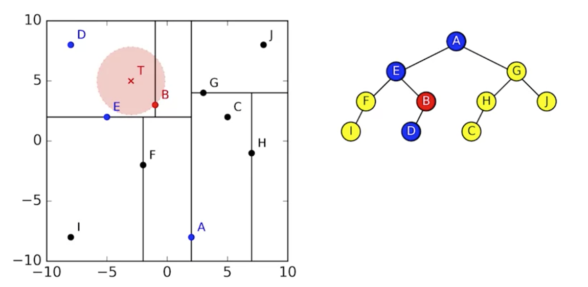
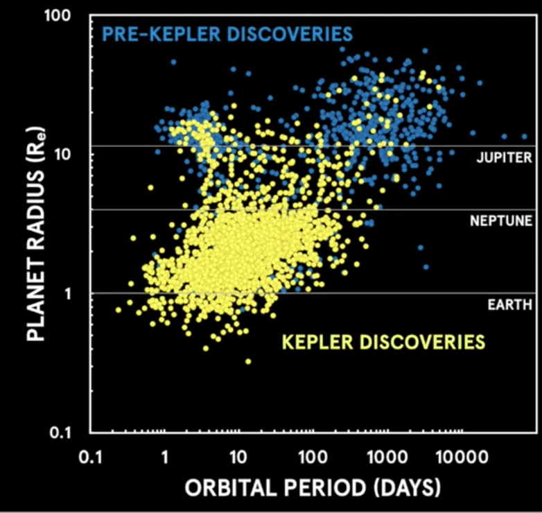

# Python programming for astronomy

The [dockerfile](https://github.com/jbcodeforce/python-code/blob/master/astronomy/Dockerfile) defines a python env with astropy, matplotlib, numpy,scipy...

To build and run it:

```
docker build -t quay.io/jbcodeforce/mypythonplay .
docker run -ti quay.io/jbcodeforce/mypythonplay bash
```

## Pulsars

The goal is to answer: *how many pulsars are detected in images taken with the Murchison Widefield Array telescope?* 
The array telescope, detects radio emission at frequencies between 80 and 300 megahertz. It has a very large field of view, which means it's great for doing large survey projects.
Images has using a grayscale to measure the flux density of emission from astronomical objects. Black is high flux density and gray is the background noise. Radio frequencies don't have color. These color maps are just used to accentuate different aspects of the intensity scale.

In radio astronomy, flux density is measured in units of Janskys, which is equivalent to 10 to the power of -26 watts per square meter per hertz.

  )

Astronomy images are usually stored in a file format called FITS, and to view them you can download software like DS9 or use an online tool like [Aladin](https://aladin.u-strasbg.fr/).

We typically call something a detection if the flux density is more than five standard deviations higher than the noise in the local region.

To search from non-detection, a special approach is used called **Stacking** which  measures the statistical properties of a population we can't detect. Stacking works because the noise in a radio image is roughly random, with a Gaussian distribution centered on zero. When you add regions of an image that just have noise, the random numbers cancel out. But when you add regions of an image in which there are signals, the signals add together, increasing what we call the signal to noise ratio.

Introduction to Pulsars (from CSIRO) Hobbs, M. (n.d.) from [http://www.atnf.csiro.au/outreach/education/everyone/pulsars/index.html](http://www.atnf.csiro.au/outreach/education/everyone/pulsars/index.html)

Pulsar Properties (from NRAO, advanced) National Radio Astronomy Observatory. (2010) from [http://www.cv.nrao.edu/course/astr534/Pulsars.html](http://www.cv.nrao.edu/course/astr534/Pulsars.html)

## Calculating the mean / median stack of a set of FITS images

In Flexible Image Transport System (FITS) the image is stored in a numerical array, which we can load into a NumPy array. Opening a FITS file in `astropy` returns a HDU (Header/Data Unit) list. Each HDU stores headers and (optionally) image data. Here is a program to find the point in the image with the maximum intensity:

```python
from astropy.io import fits
def search_brightest_pixel(fname):
  hdulist = fits.open(fname)
  data = hdulist[0].data
  nb_row,nb_col = data.shape
  max = 0
  x , y = (0,0)
  for r in range(0,nb_row):
    for c in range(0,nb_col):
      if data[r][c] > max :
          x = r
          y = c
          max = data[r][c]
  return x,y
```

A better approach is to use the median (the middle of the sorted data set), as the mean is easily skewed by outliers. But getting median could get computational intensive and consuming a lot of memory as calculating the median requires all the data to be in memory at once. This is an issue in typical astrophysics calculations, which may use hundreds of thousands of FITS files. To compute the median we can use the statistics library, or the following approach:

```python
fluxes = [17.3, 70.1, 22.3, 16.2, 20.7]
fluxes.sort()
mid = len(fluxes)//2
median = fluxes[mid]
# or for an even number of elements
median = (fluxes[mid - 1] + fluxes[mid])/2
```

or using `numpy`: 

```python
data = load_stack(fnames)
stack = np.dstack(data)
median = np.median(stack, axis=2)
```

To avoid loading all the data in memory, we can use the [binapprox algorithm](http://www.stat.cmu.edu/~ryantibs/papers/median.pdf) to approximate the current median. The idea behind it is to find the median from the data's histogram.
Starting from the left, if we sum up the counts in the histogram bins until we get to just over the expected mediam then we know the last bin we added must have contained the median. In fact it is better to search in bins around the standard devision of the mean. See [Stacking/binapprox.py](https://github.com/jbcodeforce/python-code/blob/master/astronomy/Stacking/binapprox.py) code.

## AGN: Active Galactic Nucleus

Our eyes can only detect light and the visible part of the electromagnetic spectrum.  Galaxy has Xray, visible and radio waves. At the center of the galaxy is a black hole, which has a huge impact on the galaxy's growth and formation. In cases where there is a lot of gas in the central region of the galaxy, this material can be accreted on to the black hole via an Accretion Disk, releasing a lot of energy in the process. This is what we call, an Active Galactic Nucleus. The radiation produced by the AGN is so bright that it can outshine the entire galaxy, producing far more energy than all of the galaxy's stars combined. It may form huge jets of strong magnetic fields emanating out from around the black hole. Here is an image of combined wave length from visible, X-ray and radio


The material that accretes onto a black hole produce X-rays, because particle are becoming very hot. We can assess the presence of supermassive black hole by measuring powerful jets coming from a compact core, rapid changes in the luminosity of the galaxy nucleus, very high speed orbital motions of stars in the galactic nucleus.

## Cross-matching

When investigating astronomical objects, like active galactic nuclei (AGN), astronomers compare data about those objects from different telescopes at different wavelengths. This requires positional **cross-matching** to find the closest counterpart within a given radius on the sky.

To create a catalog of object from survey images, the source-finding software uses the same technics of going through all the pixels and find peaks that are statistically significant.

How to calculate distance in the sky? Two objects in the same image are not in the same plane, we can compute the angular distance but they may be far aways on those line.

The cross matching between 2 catalogs: The BSS catalogue lists the brightest sources from the AT20G radio survey while the SuperCOSMOS catalogue lists galaxies observed by visible light surveys.

The positions of stars, galaxies and other astronomical objects are usually recorded in either equatorial or Galactic coordinates.
  
  * **Right ascension**: the angle from the vernal equinox to the point, going east along the celestial equator. Given in hours-minutes-seconds (HMS). 1 hour = 15 degrees
  * **Declination**: the angle from the celestial equator to the point, going north (negative values indicate going south). Recorded in degrees-minutes-seconds (DMS) notation. A full circle is 360 degrees, each degree has 60 arcminutes and each arcminute has 60 arcseconds.

The **vernal equinox** is the intersection of the celestial equator and the ecliptic where the ecliptic rises above the celestial equator going further east.


To crossmatch two catalogues we need to compare the angular distance between objects on the celestial sphere, which is the projected angle between objects as seen from Earth.

See [cross-matching.py code](https://github.com/jbcodeforce/python-code/blob/master/astronomy/CrossMatching/cross-matching.py) for in place comments and study. But this program is in O(n*m), there is a [Astropy]() library with cross marching, using [k-d-tree](https://en.wikipedia.org/wiki/K-d_tree) as demonstrated in [this code](https://github.com/jbcodeforce/python-code/blob/master/astronomy/CrossMatching/cross-matching-astropy.py)).



## Statistic / data science helps Astronomy

Data could not answer directly what you want to find. so we can use probability theory to assess if the data provide answer.
The approach is to try to assert hypothesis and derive what kind of data we should expect to see. Then you use the fit model approach by selecting the hypothesis that fit the best the data and throw away the ones that dont fit the data.
2016 set a record for the biggest haul of exoplanets, when the Kepler team applied statistical validation to verify over a thousand new planets.

## Exoplanets 

The science of exoplanets kicked off back in the late 1990s, the success of the space telescopes CoRoT and Kepler has really accelerated the field. Back in the 90s, we were discovering one or two planets a year, on average. 


Kepler helps discover hundreds of new planets are being confirmed every year, with thousands more candidates being found.



The most common planets are the super earth. The [NASA public catalog](https://exoplanetarchive.ipac.caltech.edu/). Here are some of the helpful attributes


| Attribute	| Description |
| --- | --- |
| Kepler ID	| Unique target identification number for stars  |
| KOI name	| String identifier for the Kepler Object of Interest (KOI) |
| Teff (K)	| Effective temperature of a star in Kelvin |
| Radius	| Radius of stars and planets in units of solar radius/earth radius respectively |
| Kepler name |	Unique string identifier for a confirmed exoplanet in the planet table |
| Period	| Orbital period of a planet in units of days |
|  Status |	Status of a discovered KOI in the planet table, e.g. "confirmed" or "false positive" |
|  Teq	 | Equilibrium temperature of a planet in Kelvin |

Some interesting queries:

```sql
SELECT koi_name, radius FROM Planet ORDER BY radius DESC LIMIT 5;
# analyse the size of the unconfirmed exoplanets (kepler_name is null).
SELECT MIN(radius), MAX(radius), AVG(radius), STDDEV(radius) FROM Planet where kepler_name is NULL;
# how many planets in the Planet database are in a multi-planet system
select kepler_id, count(koi_name) from Planet group by kepler_id having count(koi_name) > 1 order by count(koi_name) desc;
```

Which Earth sized planets are in the inhabitable zone of the host star?

To work out which planets are in the habitable zone, we'll consider the energy budget of a planet. How much energy it receives from its star versus how much it radiates back into space. The intensity of the energy decrease the further the planet is from its star. The incoming energy budget of the planet clearly depends on the brightness of its star, and how close the planet is to that star.

The insulation flux for earth is 1361 W/ m2
